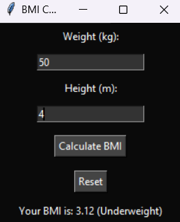

# BMI Calculator

A simple BMI (Body Mass Index) calculator developed in Python using the Tkinter library. This project includes both a command-line interface for beginners and a graphical user interface (GUI) for advanced users.

 <!-- Optional: Add an image here -->

## Project Description

The BMI Calculator allows users to calculate their BMI based on their weight and height. The application categorizes the BMI result into different health categories:

- Underweight
- Normal weight
- Overweight
- Obesity

### For Beginners
- A command-line BMI calculator that prompts users for their weight (in kg) and height (in m), calculates the BMI, and displays the result along with the category.

### For Advanced
- A graphical user interface (GUI) built using Tkinter, providing a user-friendly experience with data storage capabilities for multiple users and historical data viewing.

## Features

- User input validation to ensure valid weight and height values
- Clear categorization of BMI results
- Dark-themed GUI for better user experience
- Reset functionality to clear inputs and results

## Installation

1. Clone the repository:
   ```bash
   git clone https://github.com/yourusername/bmi-calculator.git
   ```
   
2. Change into the project directory:
   ```bash
   cd bmi-calculator
   ```

3. Install dependencies (if any in the future):
   ```bash
   pip install -r requirements.txt
   ```

## Usage

To run the BMI Calculator, you can use the following commands:

### For Command-Line Interface:
```bash
python -m app.cli
```

### For Graphical User Interface:
```bash
python -m app.gui
```

You can also run the package directly, which will load the appropriate entry point as defined in `__init__.py`.

## Contributing

Contributions are welcome! If you have suggestions for improvements or new features, feel free to fork the repository and submit a pull request.

## License

This project is licensed under the MIT License. See the [LICENSE](LICENSE) file for more details.
```
